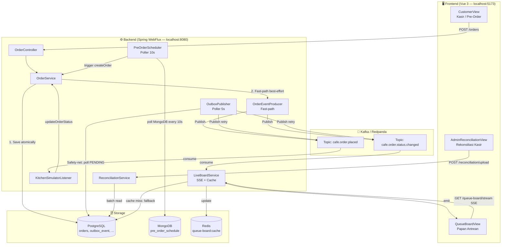

# Cafe Queue System — Technical Documentation

**Project Type:** Mini Project / Portfolio  
**Status:** Production-Ready Architecture (Local Development Scale)  
**Last Updated:** September 2026

---

## 1. Executive Summary

Cafe Queue adalah simulasi sistem manajemen antrean kafe berbasis arsitektur *enterprise-grade*. Proyek ini **bukan sekadar aplikasi CRUD biasa** — ia mensimulasikan pola arsitektur yang digunakan oleh sistem logistik dan e-commerce skala besar (Gojek, Tokopedia, dsb.) dalam skala yang dapat dipelajari dan dijalankan di mesin lokal.

### Fitur Utama
| Fitur | Teknologi Inti |
|---|---|
| Alur Pesanan Real-time | Kafka + SSE (Server-Sent Events) |
| Pre-Order Terjadwal | MongoDB + Scheduled Poller |
| Papan Antrean Live | Redis Cache + WebFlux |
| Rekonsiliasi Laporan Kasir | Batch Upload CSV |
| Ketahanan Event (Fault Tolerance) | Transactional Outbox Pattern |
| Ketahanan Layanan (Resilience) | Circuit Breaker + Retry |

---

## 2. Tech Stack

### Backend
| Komponen | Teknologi | Versi |
|---|---|---|
| Runtime | Java | 21 |
| Framework | Spring Boot | 3.3.4 |
| Reactive API | Spring WebFlux (R2DBC) | — |
| Primary DB | PostgreSQL | 15 |
| Document DB | MongoDB | 6 |
| Message Broker | Redpanda (Kafka-compatible) | Latest |
| Cache | Redis | 7 |
| DB Migration | Flyway | — |
| Resilience | Resilience4j | 2.2.0 |

### Frontend
| Komponen | Teknologi |
|---|---|
| Framework | Vue 3 (Composition API) |
| Build Tool | Vite |
| API Proxy | Vite Dev Server Proxy |

### Infrastructure
| Komponen | Tool |
|---|---|
| Container | Docker + Docker Compose |
| Kafka UI | Redpanda Console (port 8083) |
| Redis UI | Redis Commander (port 8085) |

---

## 3. Arsitektur Sistem

### 3.1 Diagram Alur Data



### 3.2 Package Structure (Backend)

```
com.example.cafequeue/
├── board/          → LiveBoardController, LiveBoardService, QueueBoardEvent
├── common/         → BaseEntity (audit columns), R2dbcConfig, GlobalExceptionHandler
├── config/         → SchedulerConfig (@EnableScheduling)
├── kitchen/        → KitchenSimulatorListener (consumer Kafka)
├── menu/           → MenuController, MenuService, MenuItem (MongoDB)
├── order/          → OrderController, OrderService, QueueTicket, PreOrder*
│   ├── dto/        → PreOrderRequest
│   └── event/      → OrderEventProducer, OrderPlacedEvent, OrderStatusChangedEvent
├── outbox/         → OutboxEvent, OutboxEventRepository, OutboxPublisher
├── payment/        → PaymentMockController (Circuit Breaker demo)
└── reconciliation/ → ReconciliationService, CashierReport*
```

---

## 4. Core Architecture Patterns

### 4.1 Transactional Outbox Pattern

**Masalah yang dipecahkan:** Jika aplikasi crash atau koneksi Kafka terputus *setelah* data tersimpan ke PostgreSQL tetapi *sebelum* event dikirim ke Kafka, event tersebut hilang selamanya.

**Solusi yang diimplementasikan:**

```
┌─────────────────────────────────────────────────────────┐
│              SATU TRANSAKSI (TransactionalOperator)      │
│                                                          │
│  1. INSERT INTO orders (...)                             │
│  2. INSERT INTO queue_ticket (...)                       │
│  3. INSERT INTO outbox_event (topic, payload, PENDING)   │
│                                                          │
└──────────────────────────┬──────────────────────────────┘
                           │ Commit sukses
                   ┌───────▼────────┐
                   │ Fast-path      │  ← Best-effort, boleh gagal diam-diam
                   │ publish Kafka  │
                   └───────┬────────┘
                           │ Jika gagal (Kafka down)
                   ┌───────▼────────────────────────────┐
                   │ OutboxPublisher (fixedDelay 5000ms) │
                   │ SELECT * FROM outbox_event          │
                   │ WHERE status = 'PENDING'            │
                   │ ORDER BY created_date ASC LIMIT 20  │
                   │                                     │
                   │ → SUKSES: status = PUBLISHED        │
                   │ → GAGAL ke-5: status = FAILED       │
                   └────────────────────────────────────┘
```

**File kunci:**
- [`OutboxEvent.java`](file:///c:/Users/Fahri/Documents/projects/cafe-queue/backend/src/main/java/com/example/cafequeue/outbox/OutboxEvent.java) — Entity tabel `outbox_event`
- [`OutboxPublisher.java`](file:///c:/Users/Fahri/Documents/projects/cafe-queue/backend/src/main/java/com/example/cafequeue/outbox/OutboxPublisher.java) — Safety-net poller
- [`OrderService.java`](file:///c:/Users/Fahri/Documents/projects/cafe-queue/backend/src/main/java/com/example/cafequeue/order/OrderService.java) — Menggunakan `TransactionalOperator` (bukan `@Transactional`) karena reaktif

> **Kenapa `TransactionalOperator` bukan `@Transactional`?**
> Spring Reactive Stack tidak menggunakan ThreadLocal untuk propagasi transaksi (seperti JPA). Konteks transaksi dibawa lewat Reactor Context. `TransactionalOperator.transactional()` membungkus seluruh Mono chain sehingga jika terjadi error di titik manapun dalam chain, semua write (orders + outbox) di-rollback bersama.

---

### 4.2 Reactive Stack (WebFlux + R2DBC)

**Kenapa tidak pakai Spring MVC + JPA?**

| Aspek | Spring MVC + JPA | Spring WebFlux + R2DBC |
|---|---|---|
| Model Thread | 1 request = 1 thread | 1 thread = banyak request |
| Bottleneck | Thread pool habis di traffic tinggi | Tidak pernah block thread |
| RAM saat 1000 koneksi | ~1GB (1000 × 1MB per thread) | ~50-100MB (event loop) |
| Cocok untuk | CRUD biasa | Streaming, SSE, high-concurrency |

Untuk Live Queue Board, sistem menggunakan **SSE (Server-Sent Events)** melalui `Flux<QueueBoardEvent>`. Tanpa WebFlux, setiap pelanggan yang menonton papan antrean akan memakan 1 thread permanen di server.

**File kunci:**
- [`LiveBoardController.java`](file:///c:/Users/Fahri/Documents/projects/cafe-queue/backend/src/main/java/com/example/cafequeue/board/LiveBoardController.java) — Endpoint SSE (`text/event-stream`)
- [`LiveBoardService.java`](file:///c:/Users/Fahri/Documents/projects/cafe-queue/backend/src/main/java/com/example/cafequeue/board/LiveBoardService.java) — Redis cache + Sink multicast

---

### 4.3 Polyglot Persistence

Sistem menggunakan **dua database berbeda** dengan peran yang berbeda:

```
PostgreSQL (ACID — Strongly Consistent)
└── orders, order_item, queue_ticket,
    queue_ticket_history, cashier_report_*,
    outbox_event
    → Digunakan untuk data finansial dan transaksi
      yang membutuhkan konsistensi ketat dan tidak
      boleh ada data hilang.

MongoDB (Document — Flexible Schema)
└── pre_order_schedule, menu_item
    → Digunakan untuk data katalog (menu berubah-ubah)
      dan pre-order yang hanya "diinapkan sementara"
      sebelum waktu pickup tiba.
```

**Kenapa Pre-Order di MongoDB?**
Pre-order belum tentu jadi pesanan sungguhan. Data ini hanya "reservasi" yang perlu disimpan fleksibel (menu bisa berbeda-beda strukturnya di masa depan) dan bersifat sementara. Menyimpannya langsung ke PostgreSQL berarti mengotori tabel transaksional dengan data yang belum tentu dieksekusi.

---

### 4.4 Event-Driven Architecture (Kafka)

Sistem menggunakan **2 topic Kafka yang terpisah** (bukan 1):

| Topic | Publisher | Consumer | Tujuan |
|---|---|---|---|
| `cafe.order.placed` | OutboxPublisher | KitchenSimulatorListener | Trigger proses memasak di dapur |
| `cafe.order.status.changed` | OutboxPublisher | LiveBoardService | Update tampilan papan antrean |

**Kenapa 2 topic, bukan 1?**
Jika dijadikan 1 topic, setiap consumer akan menerima *semua* event (termasuk yang tidak relevan). `KitchenSimulatorListener` tidak perlu tahu tentang perubahan status COOKING → READY (itu sudah tugasnya sendiri). Memisahkan topic = memisahkan tanggung jawab = *consumer bisa di-deploy independen*.

---

### 4.5 Pre-Order Delayed Job

```
User → POST /preorders
         ↓
  Simpan ke MongoDB (scheduleStatus: PENDING)
  
  [Setiap 10 detik — PreOrderScheduler]
         ↓
  Query MongoDB: findByScheduleStatus("PENDING")
         ↓
  Filter: pickupTime <= NOW + 5 menit?
         ↓ Ya
  Panggil orderService.createOrder()
         ↓
  Update MongoDB: scheduleStatus = TRIGGERED
```

**File kunci:**
- [`PreOrderScheduler.java`](file:///c:/Users/Fahri/Documents/projects/cafe-queue/backend/src/main/java/com/example/cafequeue/order/PreOrderScheduler.java) — `@Scheduled(fixedRate = 10000)`, ambang waktu `LocalDateTime.now().plusMinutes(5)`
- [`PreOrderSchedule.java`](file:///c:/Users/Fahri/Documents/projects/cafe-queue/backend/src/main/java/com/example/cafequeue/order/PreOrderSchedule.java) — `@Document(collection = "pre_order_schedule")`

---

### 4.6 Redis Caching Strategy

Live Board menggunakan Redis sebagai cache dengan strategi **partial update**, bukan full rebuild:

```
[Kafka Event Masuk]
       ↓
GET redis key "queue-board:{tanggal}"
       ↓ Cache Hit
Parse JSON → cari tiket dengan ticketNumber yang sama
       ↓
Ganti / tambahkan entry → Simpan kembali (TTL: 25 jam)

       ↓ Cache Miss (pertama kali / Redis restart)
Fetch semua tiket aktif dari PostgreSQL
       ↓
Tulis ke Redis (Cache Warming)
```

**Kenapa TTL 25 jam?** Agar cache tidak kedaluwarsa tepat saat tengah malam (misalnya, pukul 23:59:59 + 24 jam = 23:59:59 esok hari). Dengan 25 jam, ada *buffer* 1 jam yang aman dari *clock drift* dan masa sibuk tutup toko.

---

### 4.7 Circuit Breaker (Resilience4j)

Diimplementasikan pada simulasi *Payment Gateway*:

```yaml
resilience4j.circuitbreaker.instances.paymentGateway:
  slidingWindowSize: 5          # Amati 5 request terakhir
  failureRateThreshold: 50      # Buka CB jika >50% gagal
  waitDurationInOpenState: 15s  # Tunggu 15 detik sebelum coba lagi
  minimumNumberOfCalls: 5       # Minimal 5 panggilan sebelum evaluasi

resilience4j.retry.instances.paymentGateway:
  maxAttempts: 3                # Coba maksimal 3 kali
  waitDuration: 2s              # Tunggu 2 detik antar percobaan
  enableExponentialBackoff: true # 2s → 4s → 8s
```

Jika semua retry habis dan Circuit Breaker terbuka, sistem memanggil `chargeFallback()` yang mengembalikan HTTP 503 dengan pesan yang ramah pengguna.

**File kunci:** [`PaymentMockController.java`](file:///c:/Users/Fahri/Documents/projects/cafe-queue/backend/src/main/java/com/example/cafequeue/payment/PaymentMockController.java) — `@CircuitBreaker` + `@Retry`

---

## 5. Database Schema (PostgreSQL)

### 5.1 Diagram Relasi Tabel

```
orders (1)──────────────< order_item
  │                         order_id FK
  │
  └──────────────(1) queue_ticket
                    │   order_id FK
                    │
                    └──────────< queue_ticket_history
                                  queue_ticket_id FK

cashier_report_upload (1)──────< cashier_report_record
                                   upload_id FK

outbox_event (standalone — tidak ada FK)
```

### 5.2 Skema Lengkap

#### Tabel `orders`
| Kolom | Tipe | Constraint | Keterangan |
|---|---|---|---|
| `id` | UUID | PK, DEFAULT gen_random_uuid() | |
| `customer_name` | VARCHAR(255) | NOT NULL | |
| `order_type` | VARCHAR(20) | NOT NULL | DINE_IN, TAKEAWAY, PREORDER |
| `status` | VARCHAR(20) | NOT NULL | QUEUED, COOKING, READY, SERVED, CANCELLED |
| `total_price` | NUMERIC(12,2) | NOT NULL | |
| `created_by` | VARCHAR(255) | NOT NULL DEFAULT 'SYSTEM' | Audit |
| `created_date` | TIMESTAMP | NOT NULL DEFAULT now() | Audit |
| `updated_by` | VARCHAR(255) | NOT NULL DEFAULT 'SYSTEM' | Audit |
| `updated_date` | TIMESTAMP | NOT NULL DEFAULT now() | Audit |
| `mark_for_delete` | BOOLEAN | NOT NULL DEFAULT false | Soft delete |
| `optlock` | BIGINT | NOT NULL DEFAULT 0 | Optimistic lock |

#### Tabel `order_item`
| Kolom | Tipe | Constraint |
|---|---|---|
| `id` | UUID | PK |
| `order_id` | UUID | FK → orders(id) |
| `menu_item_name` | VARCHAR(255) | NOT NULL |
| `quantity` | INT | NOT NULL |
| `price` | NUMERIC(12,2) | NOT NULL |
| + kolom audit | — | Sama seperti `orders` |

#### Tabel `queue_ticket`
| Kolom | Tipe | Constraint | Keterangan |
|---|---|---|---|
| `id` | UUID | PK | |
| `order_id` | UUID | FK → orders(id) | |
| `ticket_number` | INT | NOT NULL | Nomor antrean harian |
| `status` | VARCHAR(20) | NOT NULL | Disinkronkan dengan `orders.status` |
| `status_timestamp` | TIMESTAMP | NOT NULL | Waktu perubahan status terakhir |
| `pickup_time` | TIMESTAMP | NULL | Hanya untuk Pre-Order (V4) |
| + kolom audit | — | — | |

#### Tabel `queue_ticket_history`
| Kolom | Tipe | Constraint | Keterangan |
|---|---|---|---|
| `id` | UUID | PK | |
| `queue_ticket_id` | UUID | FK → queue_ticket(id) | |
| `status` | VARCHAR(20) | NOT NULL | Snapshot status di satu titik waktu |
| `status_timestamp` | TIMESTAMP | NOT NULL | |
| `created_by` | VARCHAR(255) | NOT NULL | Audit (V2) |
| `created_date` | TIMESTAMP | NOT NULL | Audit (V2) |

#### Tabel `cashier_report_upload`
| Kolom | Tipe | Keterangan |
|---|---|---|
| `id` | UUID | PK |
| `file_name` | VARCHAR(255) | Nama file CSV yang diupload |
| `total_rows` | INT | Jumlah baris rekaman |
| `upload_status` | VARCHAR(20) | PROCESSING, COMPLETED, FAILED |

#### Tabel `cashier_report_record`
| Kolom | Tipe | Keterangan |
|---|---|---|
| `id` | UUID | PK |
| `upload_id` | UUID | FK → cashier_report_upload(id) |
| `order_id_raw` | **VARCHAR(255)** | ⚠️ Sengaja VARCHAR, bukan UUID — karena data dari CSV belum tentu valid (bisa salah ketik, format berbeda, dsb). Validasinya dilakukan di layer service. |
| `amount_paid` | NUMERIC(12,2) | Jumlah yang dibayar kasir |
| `paid_timestamp` | TIMESTAMP | Waktu transaksi |
| `reconciliation_status` | VARCHAR(20) | MATCHED, AMOUNT_MISMATCH, ORDER_NOT_FOUND |
| `note` | VARCHAR(500) | Keterangan hasil rekonsiliasi |

#### Tabel `outbox_event`
| Kolom | Tipe | Keterangan |
|---|---|---|
| `id` | UUID | PK |
| `aggregate_type` | VARCHAR(50) | Misal: 'ORDER' |
| `aggregate_id` | UUID | ID order terkait |
| `topic` | VARCHAR(100) | Nama Kafka topic tujuan |
| `payload` | **JSONB** | Isi event (identik dengan struct event Java) |
| `status` | VARCHAR(20) | PENDING, PUBLISHED, FAILED |
| `retry_count` | INT | Jumlah percobaan publish |
| `published_date` | TIMESTAMP | Waktu berhasil dikirim (NULL jika belum) |

**Index:** `idx_outbox_pending ON outbox_event (status, created_date) WHERE status = 'PENDING'` — Partial index agar query poller sangat cepat.

### 5.3 Riwayat Migrasi Flyway

| Versi | File | Isi |
|---|---|---|
| V1 | `V1__init_order_schema.sql` | Tabel inti: `orders`, `order_item`, `queue_ticket`, `queue_ticket_history` |
| V2 | `V2__add_audit_columns_to_queue_ticket_history.sql` | Menambah `created_by` & `updated_by` pada history (terlewat di V1) |
| V3 | `V3__cashier_reconciliation.sql` | Tabel rekonsiliasi: `cashier_report_upload`, `cashier_report_record` |
| V4 | `V4__add_pickup_time.sql` | Kolom `pickup_time` pada `queue_ticket` (untuk fitur Pre-Order) |
| V5 | `V5__transactional_outbox.sql` | Tabel `outbox_event` + partial index (Outbox Pattern) |

---

## 6. Database Schema (MongoDB)

### Collection `pre_order_schedule`

```json
{
  "_id": "ObjectId(...)",
  "customerName": "Budi",
  "items": [
    { "menuItemName": "Kopi Susu", "quantity": 1, "price": 22000 }
  ],
  "pickupTime": "2026-09-14T11:30:00",
  "scheduleStatus": "PENDING",
  "createdBy": "SYSTEM",
  "createdDate": "2026-09-14T10:00:00",
  "markForDelete": false
}
```

**Nilai `scheduleStatus`:** `PENDING` → `TRIGGERED`

### Collection `menu_item`

```json
{
  "_id": "ObjectId(...)",
  "name": "Kopi Susu",
  "price": 22000,
  "category": "BEVERAGE",
  "available": true
}
```

---

## 7. API Endpoints

### Order

| Method | Endpoint | Deskripsi |
|---|---|---|
| `POST` | `/orders` | Buat pesanan baru |
| `GET` | `/orders/{id}` | Ambil detail pesanan |
| `DELETE` | `/orders/{id}` | Batalkan pesanan (ubah status ke CANCELLED) |

### Pre-Order

| Method | Endpoint | Deskripsi |
|---|---|---|
| `POST` | `/preorders` | Jadwalkan pre-order ke MongoDB |

### Queue Board (SSE)

| Method | Endpoint | Deskripsi |
|---|---|---|
| `GET` | `/queue-board/stream` | Stream SSE real-time (`text/event-stream`) |
| `GET` | `/queue-board/current` | Snapshot data antrean saat ini |

### Menu

| Method | Endpoint | Deskripsi |
|---|---|---|
| `GET` | `/menu` | Ambil seluruh daftar menu |

### Reconciliation

| Method | Endpoint | Deskripsi |
|---|---|---|
| `POST` | `/reconciliation/upload` | Upload CSV laporan kasir |
| `GET` | `/reconciliation/reports` | Daftar upload history |
| `GET` | `/reconciliation/reports/{id}/records` | Detail rekaman rekonsiliasi |

### Payment (Demo)

| Method | Endpoint | Deskripsi |
|---|---|---|
| `POST` | `/payment/mock-charge` | Demo Circuit Breaker + Retry |

---

## 8. Frontend — Halaman & Filosofi Desain

### 8.1 Tiga Halaman Utama

| Halaman | Route | File | Deskripsi |
|---|---|---|---|
| Kasir / POS | `/` | `CustomerView.vue` | Form pesanan + Pre-Order booking |
| Papan Antrean | `/board` | `QueueBoardView.vue` | Live board via SSE, update otomatis |
| Admin Rekonsiliasi | `/admin` | `AdminReconciliationView.vue` | Upload CSV + tabel hasil |

### 8.2 Filosofi Desain: "Industrial Kitchen & Thermal Paper"

Desain **bukan** menggunakan template UI generik. Filosofinya:

> *"Ini adalah alat kerja staf profesional, bukan aplikasi konsumen."*

Prinsip implementasinya:
- **`border-radius: 0`** di seluruh komponen — tidak ada sudut membulat
- **`border: 4px solid #000000`** — garis keras, bukan bayangan lembut
- **Oswald** untuk heading, `system-ui` untuk body, `monospace` untuk UUID/kode
- **Hard offset shadow** (`4px 4px 0px #0F172A`) bukan `box-shadow` blur

### 8.3 Token Warna

| Token | Hex | Penggunaan |
|---|---|---|
| Workbench Gray | `#E5E7EB` | Background halaman |
| Thermal Paper | `#FFFFFF` | Background card/form |
| Printer Ink | `#0F172A` | Teks utama, border |
| Action Blue | `#2563EB` | Tombol aksi utama |
| Urgency Red | `#B91C1C` | Status error, badge Pre-Order |

### 8.4 Aksesibilitas

- ✅ **Focus state:** `outline: 3px dashed #2563EB` pada semua elemen interaktif
- ✅ **`prefers-reduced-motion`:** Semua `transition` dinonaktifkan via media query
- ✅ **Mobile responsive:** Kolom antrean collapse pada layar kecil

---

## 9. Cara Menjalankan (Local Development)

### Prasyarat
- Docker Desktop
- Java 21 (JDK)
- Node.js 18+

### Langkah 1 — Jalankan Infrastruktur via Docker

```bash
docker compose up -d
```

Ini akan menjalankan: PostgreSQL (port 5433), MongoDB (27017), Redis (6379), Redpanda/Kafka (9092), Redpanda Console (8083), Redis Commander (8085).

### Langkah 2 — Jalankan Backend

```bash
cd backend
./mvnw spring-boot:run -Dspring-boot.run.jvmArguments="-Duser.timezone=UTC"
```

> **Penting:** Flag `-Duser.timezone=UTC` wajib ada agar timestamp tidak bergeser +7 jam saat dijalankan di Windows.

Backend akan berjalan di `http://localhost:8080`. Flyway otomatis menjalankan migrasi V1–V5 saat startup.

### Langkah 3 — Jalankan Frontend

```bash
cd frontend
npm install   # hanya pertama kali
npm run dev
```

Frontend akan berjalan di `http://localhost:5173`.

### Akses URL

| Layanan | URL |
|---|---|
| Aplikasi Kasir | http://localhost:5173 |
| Papan Antrean | http://localhost:5173/board |
| Admin Rekonsiliasi | http://localhost:5173/admin |
| Redpanda Console (Kafka UI) | http://localhost:8083 |
| Redis Commander | http://localhost:8085 |

---

## 10. Known Technical Debt

Keputusan yang sengaja disederhanakan untuk tujuan belajar dan yang **akan berbeda di sistem production sungguhan**:

| # | Keputusan Saat Ini | Di Production Seharusnya |
|---|---|---|
| 1 | Semua layanan dalam 1 JVM (monolith) | Dipecah menjadi container terpisah: `order-service`, `board-service`, dsb. |
| 2 | Polling MongoDB setiap 10 detik untuk Pre-Order | AWS EventBridge / Quartz Scheduler / RabbitMQ Delayed Message |
| 3 | `KitchenSimulatorListener` pakai `Mono.delay()` | API ke tablet KDS (Kitchen Display System) fisik di dapur |
| 4 | `PaymentMockController` simulasi 30% gagal | Webhook asli dari Midtrans / Stripe |
| 5 | Tidak ada autentikasi (zero auth) | Spring Security + JWT Token |
| 6 | Tidak ada idempotency key | Header `Idempotency-Key` di API untuk cegah submit ganda |

---

## 11. Peta ke Dunia Nyata

| Pola di Project Ini | Padanan di Industri |
|---|---|
| Kafka 2 topic (placed + status.changed) | Sistem checkout Tokopedia/Shopee yang memisahkan event per domain |
| MongoDB Delayed Job (Pre-Order) | Fitur Scheduled Ride di Gojek/Grab |
| Reconciliation Batch Upload | Proses EOD (End of Day) Settlement di Xendit/Midtrans |
| Reactive API (WebFlux + R2DBC) | Flash Sale server (high-concurrency, non-blocking) |
| Transactional Outbox | Pola standar di microservices finansial untuk menjamin exactly-once delivery |
| Brutalist UX / Functional Design | B2B Internal Tools & Layar Medis (prioritas visibilitas > estetika) |
